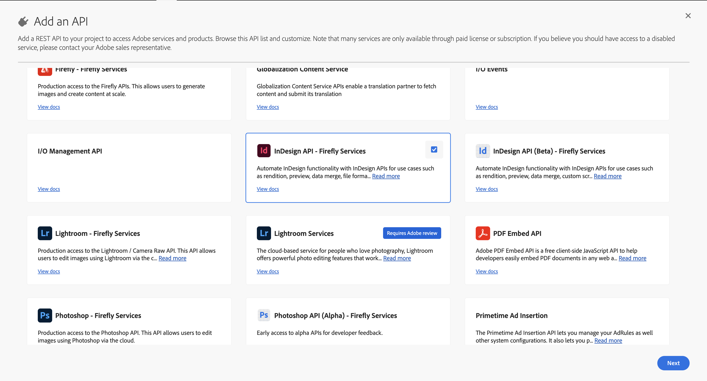

# InDesign API Key Concepts

## Adobe Developer Console

### Overview

The **Adobe Developer Console** is an administration interface that
enables developers to manage Adobe's APIs and services. To securely
access Adobe's APIs, including the InDesign API, your application must
authenticate using OAuth 2.0 protocols. This involves obtaining an
access token that grants your application permissions to interact with
Adobe's services.

### You will need:

- An [Adobe Developer Console](https://developer.adobe.com/) account.

- A [project](https://developer.adobe.com/developer-console/docs/guides/projects/projects-empty/) with
  Firefly API [OAuth Server-to-Server credentials set
  up](https://developer.adobe.com/developer-console/docs/guides/services/services-add-api-oauth-s2s/).

- Add and configure **InDesign API Firefly Services** to your new
  project.

- Access to your Client ID and Client Secret from the Developer Console.



### Access Tokens

You can [generate access
tokens](https://developer.adobe.com/developer-console/docs/guides/services/services-add-api-oauth-s2s/#api-overview)
either directly from the Developer Console UI or programmatically.

### Best Practices

- **Token Management:** Access tokens are valid for 24 hours. Implement
  a mechanism to refresh tokens before they expire to maintain
  uninterrupted access.

- **Scope Limitation:** Request only the scopes necessary for your
  application's functionality to adhere to the principle of least
  privilege.

- **Secure Storage:** Store your Client ID, Client Secret, and access
  tokens securely to prevent unauthorized access.

## Pre-signed URLs

### What is a pre-signed URL?

A pre-signed URL is a URL that grants temporary access to a specific
resource, typically in cloud storage, with predefined permissions and an
expiration time. It allows users to upload or download files securely
without needing direct access to the storage service\'s credentials.

While using InDesign APIs, the input and output assets are stored as
pre-signed URLs. Let's learn more about each of them.

### Input Assets

The platform supports multiple asset types. These asset types signify
storage repositories from which the platform can download. You can
provide the input asset information within the \`"assets"\` array.

InDesign APIs support the following storage types to refer your assets
from:

- **AWS S3**: Use a pre-signed GET/PUT/POST URL. Refer
  [this](https://docs.aws.amazon.com/AmazonS3/latest/userguide/Welcome.html)
  to get started

- **Dropbox**: Generate temporary upload/download links using
  [this](https://dropbox.github.io/dropbox-api-v2-explorer/) link.

- **Azure**: Use a Shared Access Signature (SAS) in Azure Storage for
  GET/PUT/POST operations. Refer
  [this](https://learn.microsoft.com/en-us/azure/storage/) to get
  started.

```json
assets:[
    {
        "source" : {
            "storageType" : "Azure", //Optional
            "url" : "https://xyz-blob.core.windows.net/Template.indt"
        },
        "destination" : "jobasset/template1.indt"
    },
    {
        "source" : {
            "storageType" : "Aws", //Optional
            "url" : "https://s3.eu-west-1.amazonaws/xyz/Template.indt"
        },
        "destination" : "jobasset/template2.indt"
    }
]
```

In all the above examples, you can see that data is divided into source
and destination. The first attribute, 'source,' is where the asset is
downloaded from. The second attribute, 'destination,' refers to where
the asset would be downloaded to.

### Output Assets

Like input assets, the platform supports multiple asset types for
output. These asset types signify storage repositories to which the
platform can upload. You can provide this information in the "outputs"
array within the body of the request.

```json
"outputs": [
    {
        "destination" : {
            "type" : "Azure",
            "url" : "https://xyz-blob.core.windows.net/Template.indt"
        },
        "source" : "jobasset/template.indt"
    }
]
```

Each storage provider may have its own requirements for creating PUT or
POST pre-signed URLs. Please follow the documentation from the
individual storage provider creating these URLs.

## Capability Zip Setup

The typical workflow involves making one or more calls. There are four
steps in the typical workflow, which are described in detail in below
sections:

### Create a capability Bundle

A capability bundle is a simple zip file with a predefined structure

Note: When zipping the files, don\'t place them inside a folder first.
Instead, directly select the files and create the zip. This way, when
unzipped, the files will appear directly, not inside a folder.

### Capability Bundle Structure

A simple structure for a capability bundle would look like this:

```
capability-folder
|------ manifest.json
|------ capability.js
```

| File          | Description                                                                                                                                                                                                                                                                  | Optional |
|---------------|------------------------------------------------------------------------------------------------------------------------------------------------------------------------------------------------------------------------------------------------------------------------------|----------|
| manifest.json | This is the capability manifest. All the relevant details about the capability are described here.                                                                                                                                                                           | No       |
| capability.js | This is the primary executable for the capability. This script gets executed by the product script engine. Depending on the product script engine support, this can depend on other files as well. These additional files can also be in nested directories in the zip file. | No       |


### Capability Manifest

The manifest file is a plain JSON file with the following structure:
```json
{
    "manifestVersion": "1.0.0",
    "id": "Unique id for the capability",
    "name": "Name of the capability",
    "version": "0.0.1",
    "host": {
        "app": "indesign",
        "minVersion": "17.0.0",
        "maxVersion": "99.9.9"
    },
    "apiEntryPoints": [
        {
            "type": "capability",
            "path": "capability.js",
            "language": "extendscript"
        }
    ]
}
```
The description of all the fields of the manifest.json file is available below:

| Field           | Type                        | Description                                                                                                                                                                                 | Optional |
|-----------------|-----------------------------|---------------------------------------------------------------------------------------------------------------------------------------------------------------------------------------------|----------|
| manifestVersion | string                      | The version of the manifest file format. Currently, only 1.0.0 is supported.                                                                                                                | No       |
| name            | string                      | Name of the capability. The capability can be invoked using this. It should be between 4-255 characters. Must not have any white space.                                                     | No       |
| version         | string                      | The version number of the capability in x.y.z format. The version must be three segments and each version component must be between 0 and 99.                                               | No       |
| host.app        | string                      | The host application would be used to execute this capability. Currently, the only valid value is indesign.                                                                                     | No       |
| host.minVersion | string                      | Minimum required version of the host app (in x.y format) that can run this plugin. The version number must be two segments. Typically, the minor segment will be always set to 0, e.g. 17.0 | No       |
| host.maxVersion | string                      | The maximum version of the host app that can run this plugin. Same formatting as host.minVersion.                                                                                           | Yes      |
| apiEntryPoints  | array<EntryPointDefinition> | Describes the API entry points for the capability. See the next section for details.                                                                                                        | Yes      |

The apiEntryPoints field is an array of objects matching the
EntryPointDefinition format specified below. There can be only one entry
of each type in the array. The size of the array is at most 3. An entry
point specifies a capability script or a capability specification. There
is no need to define an entry point if the default values are being used
for them.

|           |          |                                                                                                                                                                                        |          |
|-----------|----------|----------------------------------------------------------------------------------------------------------------------------------------------------------------------------------------|----------|
| **Field** | **Type** | **Description**                                                                                                                                                                        | Optional |
| type      | string   | The type of entry point. Valid values are capability                                                                                                                                   | No       |
| path      | string   | The file path should be used based on the type. The default is to look for the files in the root directory of the zip file. However, this can also be any nested path in the zip file. | No       |
| language  | string   | The language of the script. It can be an extended script, UXP script, or javascript.                                                                                                   | Yes      |

### Updating a Capability Bundle

The capability bundle can be updated by incrementing the version in the
capability manifest. The updated ZIP bundle can be uploaded using the
submission endpoint.

## InDesign Links support

Links are one of the most essential features of InDesign. You can place
and link content within the same document or across different documents.
This helps keep the assets and the document decoupled. Links can
correspond to texts, graphics, etc.

- InDesign APIs support the processing of documents with links.

- A temporary folder/directory, called the working directory, is created
  to process a request.

- All the input assets mentioned in the request are downloaded and kept
  in the working directory.

- Within the working directory, the location of individual assets is
  governed by the relative path mentioned in the ''destination'
  attribute.

- Please note that the value mentioned in the destination property must
  be used to refer to the same asset in the rest of the parameters.

You can use the following ways to make links work. It can be done in two
ways:

- Maintain relative paths of assets to the target document. You need to
  place the files outside the working directory to do this.

- If you place the linked assets parallel to the target document, the
  links get resolved, and the assets will be picked.

Sometimes, the documents contain custom links that InDesign does not
understand. To allow proper job execution, the custom URLs can be
relinked to assets provided in the request. Here's an example of this:

```json
{
    "params": {
        "generalSettings": {
            "links": {
                "replaceLinks": [
                    {
                        "targetDocument": "TargetDocument.indd",
                        "mapping": [
                            {
                                "currentURI": "customScheme:4c189e2d-315e-4fab-a8c2-45690e44d1f0",
                                "newAssetRelativePath": "SomeNewAsset.png"
                            }
                        ]
                    }
                ]
            }
        }
    }
}
```

In this example, the existing URI `"customScheme:4c189e2d-315e-4fab-a8c2-45690e44d1f0"` in the document `"TargetDocument.indd"` cannot be interpreted by InDesign by itself. The caller would have provided an input asset with `"destination"` attribute as `"SomeAsset.png"`.

By using the above example the caller is asking to relink the links with the specified URI to be relinked to the new asset, which is present at <Working_Directory>/SomeNewAsset.png

## Using Custom Fonts

Custom fonts or user fonts can be provided as a regular asset.

```json
{

    "assets":[
        {
            "source": {
                "url":"<YOUR PRE-SIGNED URL>",
                "type":"HTTP_GET"
            },
            "destination" : "Cheese_final.indd"
        },
        {
            "source": {
                "url":"<YOUR PRE-SIGNED URL>",
                "type":"HTTP_GET"
            },
            "destination" : "FontName.otf"
        }
    ]
}
```

For the fonts to be picked properly, please place them in the "Document
Fonts" folder parallel to the document that uses them. Or, if the fonts
are kept under some other folder say "fontFolder", please specify the
font directory as follows:

```json
{
    "params": {
        "generalSettings": {
            "fonts": {
                "fontsDirectories": [
                    "fontFolder"
                ]
            }
        }
    }
}
```