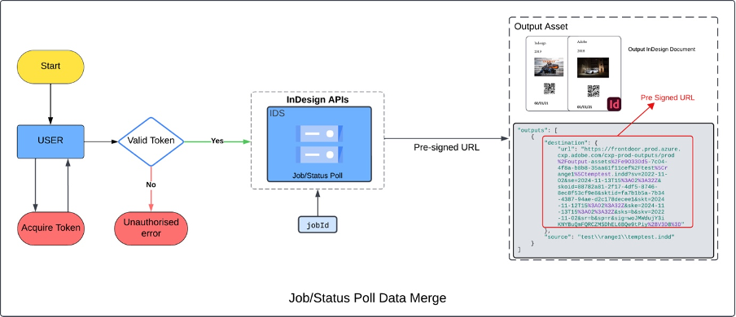

# Getting the status of a request

https://indesign.adobe.io/v3/status/{id}

The platform provides status on execution in the form of events. Each
event corresponds to different stages of execution. Currently, these
events are available by polling the status API. The status API url is
available in the response of the execution request.



The json structure of all the events is available in the [API Spec](https://adobedocs.github.io/indesign-api-docs/#/:~:text=GET-,/v3/status/%7Bid%7D,-Gets%20latest%20status)

| **Event**     | **Description**                                          |
|---------------|----------------------------------------------------------|
| **not_started** | Generated at the time of creation of the job             |
| **running**     | Generated while execution is going on at app-engine      |
| **succeeded**   | Generated when execution of a capability is complete     |
| **failed**      | Generated if capability execution fails                  |


Sample request:
```curl
curl --location --request POST 'https://indesign.adobe.io/api/v3/create-rendition' \
--header 'Authorization: bearer <access_token>' \
--header 'x-api-key: <client_id>' \
--header 'Content-Type: application/json' \
--data-raw '{
    "assets":[
        {
            "source": {
                "url":<pre-signed url>,
                "storageType":"Azure"
            },
            "destination" : "3PageDoc.indd"
        }
    ],
    "params":{
         "outputMediaType":"image/png",
         "targetDocuments": [
            "3PageDoc.indd"
         ],
         "pageRange": "1-3",
         "outputFileBaseString": "template_rendition"
    }
}'
```
The response to the request will be something like
```json
{
    "statusUrl": "https://indesign.adobe.io/v3/status/ee9f6ee4-ea8c-40d5-a548-f7a0e5a2ca85",
    "jobId": "ee9f6ee4-ea8c-40d5-a548-f7a0e5a2ca85"
}
```
* `"jobId"`: Corresponds to the jobID. Use this to know the status.
* `"statusUrl"`: Use this to get the latest status event of the job.

 