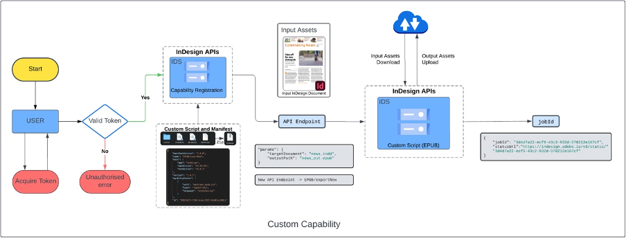
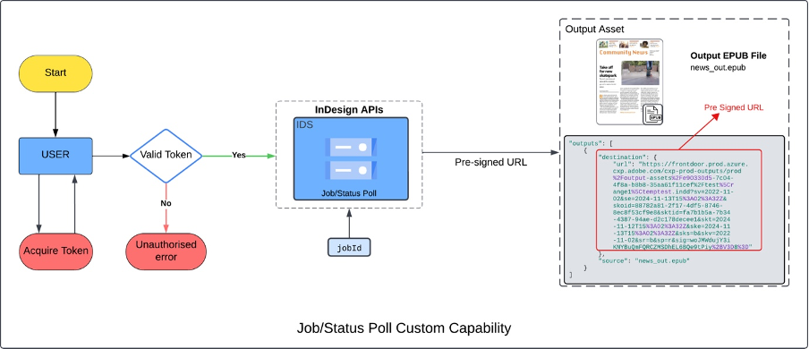

# Working with Capabilities API

As a developer, there will be times when you'd like to utilize more powers of InDesign using custom script. With our Capabilities API, one can run a [custom script](#curl-request) (registered using
capabilities registration API) on any input document. Refer the [API Spec](https://adobedocs.github.io/indesign-api-docs/#/:~:text=POST-,/v3/capability,-Submit%20custom%20capability)
for more details on API.



Capability registration API -

[https://indesign.adobe.io/v3/capability](https://indesign.adobe.io/v3/capability)

```curl
curl --request POST \
--url https://indesign.adobe.io/v3/capability \
--header 'Authorization: Bearer <YOUR_OAUTH_TOKEN>' \
--header 'x-api-key: <YOUR_API_KEY>' \
--header 'Content-Type: multipart/form-data' \
--header 'x-gw-ims-org-id: <YOUR_ORG_ID>' \
--form file=@<YOUR_CUSTOM_SCRIPT_ZIP>
```

Response will look like: 

```json
{
  "url": "https://indesign.adobe.io/v3/a2fa0a44c6ea04bafcc15f878788ea46/sample-execution",
  "capability": "sample-execution",
  "version": "1.0.0"
}
```


The ```URL``` is
https://indesign.adobe.io/v3/a2fa0a44c6ea04bafcc15f878788ea46/sample-execution
and `a2fa0a44c6ea04bafcc15f878788ea46`
is the `{capability_id}`

Capability execution API

https://indesign.adobe.io/v3/{capability_id}/sample-execution

To run a capability/custom script on a document --

```curl
curl --request POST \
--url https://indesign.adobe.io/v3/<YOUR_CAPABILITY_ID>/sample-execution \
--header 'Authorization: Bearer <YOUR_OAUTH_TOKEN>' \
--header 'Content-Type: application/json' \
--header 'x-api-key: <YOUR_API_KEY>' \
--header 'x-gw-ims-org-id: <YOUR_ORG_ID>' \
--data-raw '{
  "assets": [
    {
      "source": {
        "url": "<YOUR_PRE-SIGNED_URL>"
      },
      "destination": "sample.indd"
    }
  ],
  "params": {
    "targetDocument": "sample.indd",
    "outputPath": "converted.idml"
  }
}'

```
Response-
```json
{ 

"jobId": "9b9d00c5-8659-4766-8430-ed0a1c9bd87d", 

"statusUrl": "https://indesign.adobe.io/v3/status/9b9d00c5-8659-4766-8430-ed0a1c9bd87d" 

} 
```
Each execution request is an Async operation for which the status can be
fetched using the status API. More details are available in [API
Spec](https://adobedocs.github.io/indesign-api-docs/#/:~:text=POST-,/v3/capability,-Submit%20custom%20capability) .

All assets specified in the execution request are downloaded on the
local file system using the specified identifiers. The capability script
should be authored to work against locally downloaded assets.

The execution request can include a parameter block in the form of a
JSON dictionary. The capability defines the parameters and passes as is
to it during execution. Optionally, an upload location can also be
provided as part of the execution request.

All generated output is uploaded to the provided target location. The
generated output assets are uploaded to temporary storage if no location
is provided. A link with expiry is provided in the execution status.
