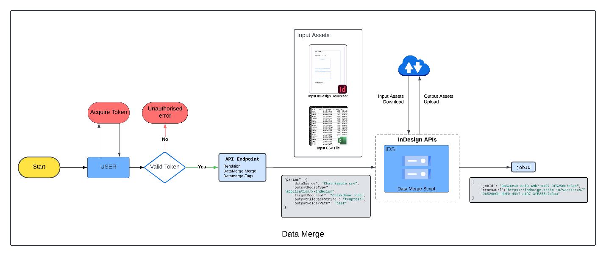

# Working with Data Merge API

The Data Merge API involves two components: Data Merge and Data Merge Tags.

## Data Merge

[https://indesign.adobe.io/v3/merge-data](https://indesign.adobe.io/v3/merge-data)

Data merge enables you to generate variations of a template document
from data.




The following example takes the ```Directory_Names.csv``` (UTF-16BE encoded)
data and creates different variations of ```dataMergeTemplate.indd```. The
output is a merged INDD file of all variations.

```curl
curl --location --request POST 'https://indesign.adobe.io/v3/merge-data' \
--header 'Authorization: Bearer <YOUR_OAUTH_TOKEN>' \
--header 'x-api-key: <YOUR_API_KEY>' \
--header 'Content-Type: application/json' \
--data-raw '{
  "assets": [
    {
      "source": {
        "url": "<YOUR_PRE-SIGNED_URL>",
        "storageType": "Azure"
      },
      "destination": "dataMergeTemplate.indd"
    },
    {
      "source": {
        "url": "<YOUR_PRE-SIGNED_URL>",
        "storageType": "Azure"
      },
      "destination": "Directory_Names.csv"
    }
  ],
  "params": {
    "targetDocument": "dataMergeTemplate.indd",
    "outputMediaType": "application/x-indesign",
    "outputFolderPath": "outputfolder",
    "outputFileBaseString": "merged",
    "dataSource": "Directory_Names.csv"
  },
  "outputs": [
    {
      "destination": {
        "url": "<YOUR_PUT-SIGNED_URL>"
      },
      "source": "outputfolder/merged.pdf"
    }
  ]
}'
```

##  Encoding CSV in Data Merge API

The Data Merge API supports UTF-16BE encoding for CSV files, which is necessary for languages or characters requiring multi-byte representation. For plain English characters, the CSV will function correctly even without this encoding.

## Data Merge Tags

[https://indesign.adobe.io/v3/merge-data-tags](https://indesign.adobe.io/v3/merge-data-tags)

Retrieves the data merge tags from the document.

```curl
curl --location --request POST 'https://indesign.adobe.io/v3/merge-data-tags' \
--header 'Authorization: Bearer <YOUR_OAUTH_TOKEN>' \
--header 'x-api-key: <YOUR_API_KEY>' \
--header 'Content-Type: application/json' \
--data-raw '{
  "assets": [
    {
      "source": {
        "url": "<YOUR_PRE-SIGNED_URL>",
        "storageType": "Azure"
      },
      "destination": "dataMergeTemplate.indd"
    },
    {
      "source": {
        "url": "<YOUR_PRE-SIGNED_URL>",
        "storageType": "Azure"
      },
      "destination": "batang.ttc"
    }
  ],
  "params": {
    "outputMediaType": "application/x-indesign",
    "targetDocument": "dataMergeTemplate.indd",
    "includePageItemIdentifiers": true
  }
}'
```


